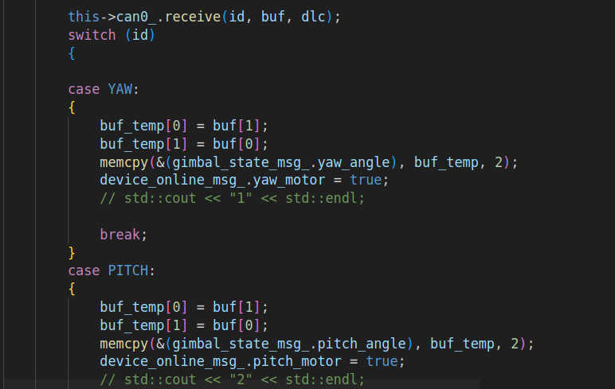

## 主要问题

难以解决的问题：拨盘kp调大极其容易震荡，kp小的时候拨盘无力，和C版控制区别相当之大

问题分析：可能是通信写的有问题，以`GimbalHWNode::gimbalRecevieCallBack`为例，该线程以10000hz运行

每次收到`case YAW`， `case PITCH`， `case AMMOR`， `case AMMOL`， `case ROTOR`的顺序不同，可能存在数据被挤掉的情况。但是接受各个case又能达到1000hz，满足控制频率要求

分析：主要从频率、延时、丢包等角度考虑

可能解决办法：

1.阅读[广工的代码](https://github.com/rm-controls/rm_control)，参考他们的实现方式

但是他们用线程，我们的也已经从回调函数改成线程。

2.使用电控的相关工具测发送接收数据的真实延时

3.每一个电机分别开一个1000hz线程

感觉很抽象

## 其他次要问题

短期可以解决：
开机yaw轴抽搐

暂时不清楚的问题：
1.skider_control包launch文件的参数路径问题
如果采用绝对路径，部署时要更改一次绝对路径。
如果采用get_package_share_directory的方式寻找路径，则每次调整pid参数都要编译，较为麻烦

代码重构：
1.需要重新写PID类并调整PID类的文件位置
2.修改姿态解算部分代码实现编译时不输出warning
