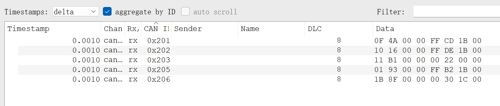

## 主要问题

**问题描述**：拨盘kp调大极其容易震荡，kp小的时候拨盘无力，和C版控制区别相当之大

**问题分析**：可能是通信写的有问题，以`GimbalHWNode::gimbalRecevieCallBack`为例，该线程以10000hz运行

每次收到`case YAW`， `case PITCH`， `case AMMOR`， `case AMMOL`， `case ROTOR`的顺序不同，可能存在数据被挤掉的情况。但是接受各个case又能达到1000hz，满足控制频率要求

### 分析

通过CAN抓包可以看到每一个电机的回报频率均为1khz，且多条CAN消息几乎同时到达。

can1:

can2:

绝对时间戳:

所以开一个1khz线程来轮询接收一定会漏掉大量电机反馈信息。

**可能解决办法**：

1.阅读[广工的代码](https://github.com/rm-controls/rm_control)，参考他们的实现方式

但是他们用线程，我们的也已经从回调函数改成线程。

2.每一个电机分别开一个1000hz线程

3.借鉴后端的思路，在死循环中阻塞监听，接收到一条消息后立刻向线程池提交处理并继续监听，这样可以不受ros的定时系统的限制，最大化接收频率

感觉很抽象

## 其他次要问题

**短期可以解决**：
开机yaw轴抽搐
